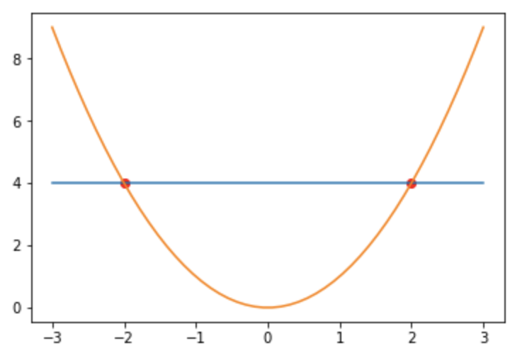
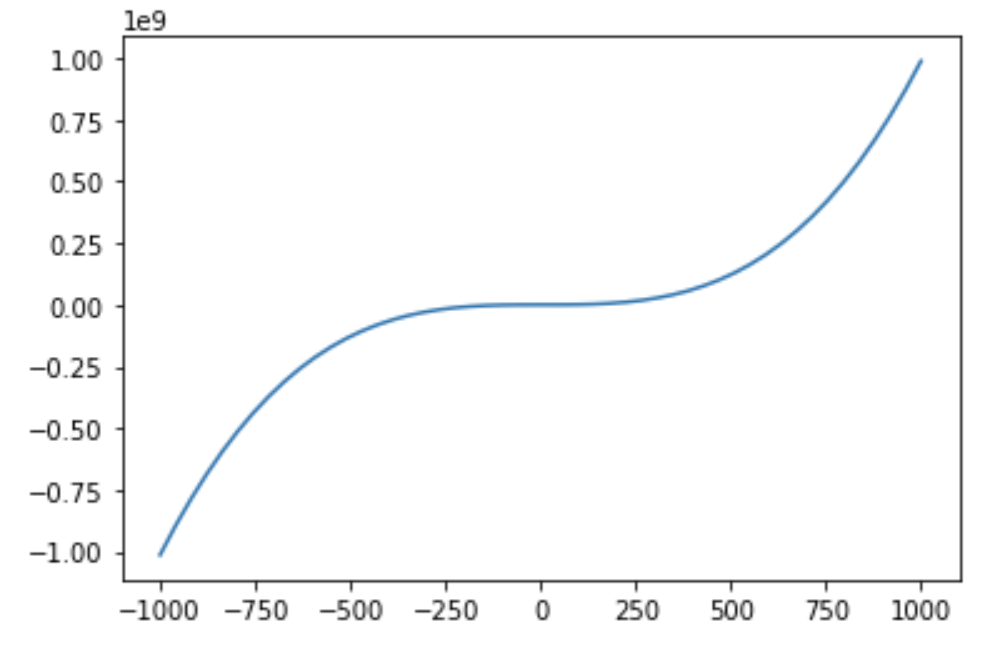

<title>1.2: Functions and Bijections – Sets, Functions, and Logic</title>

# 1.2: Functions and Bijections
---

 

Jump to:
- [Relations and Functions](#relations-functions)
- [Representation](#representation)
- [Injections](#injections)
	- [Proving Injectivity](#determine_injection)
	- [Injections and Cardinality](#injection_cardinality)
- [Surjections](#surjections)
	- [Proving Surjectivity](#determine_surjection)
	- [Surjections and Cardinality](#surjection_cardinality)
- [Bijections](#bijections)
	- [Bijections and Cardinality](#bijection_cardinality)

 

We now have enough background to introduce functions in a formal way. 

**Note**: We briefly mention the idea of the set of real numbers in some of the following examples, though we have not yet described what the real number set is. That's because we think it's best to study the definition of a function before we study the various number sets (covered in the next section). However, the usage of the real numbers here is not very detailed nor significant, but feel free to ask questions for clarification!

 

<a name='relations-functions'>

## Relations and Functions
---

</a>

A **relation** with _domain_ $A$ and _codomain_ $B$ is a subset of $A \times B$. For example, if $$A = \\{ \text{"Hi"}, \text{"Hey"}\\}$$ and $$B = \\{5, 10\\}$$, a relation $$r$$ on $$A \times B$$ is any subset of 

$$A \times B = \\{ (\text{"Hi"}, 5), (\text{"Hi"}, 10), (\text{"Hey"}, 5), (\text{"Hey"}, 10) \\}$$

For instance, $$r: \\{ (\text{"Hi"}, 5), (\text{"Hi"}, 10), (\text{"Hey"}, 10) \\}$$. Inherently, all a relation states is that these ordered pairs are related in some way.

We say $f$ is a **function** with _domain_ $A$ and _codomain_ $B$ if $f \subset A \times B$ such that for every element in $A$, there is exactly one element in $B$. Symbolically, we represent this as $f : A \rightarrow B$. This means that all functions are relations.

We form a function $$f$$ by removing elements from $$A \times B$$ such that there are only as many elements as there are in $$A$$. The following sets $$f$$ and $$g$$ are examples of functions sending elements from $$A$$ to $$B$$:

$$f = \\{ (\text{"Hi"}, 10), (\text{"Hey"}, 5) \\}$$

$$g = \\{ (\text{"Hi"}, 5), (\text{"Hey", 5}) \\}$$

We say $$A$$ is the **domain**, as it represents all possible inputs, and $$B$$ is the **codomain**, as it represents all possible outputs; as a result, we say that $$f(A) = B$$. However, the **image**, or **range**, is the set of all actual outputs of a function. In the example $$g$$ above, the image would not be $$B$$, since 10 is never actually an output (though it is a possible output); instead, the range would be the set $$\\{ 5 \\}$$. $$f$$, however, behaves in a way such that the range and codomain are the same. 

Notice that the domain in this case isn't even a set of numbers. In virtually all cases, you will be dealing with functions with numbers as both inputs and outputs, but it's important to see that there's nothing inherently numeric about the definition of a function.

In the following [image](https://upload.wikimedia.org/wikipedia/commons/6/64/Codomain2.SVG), the red area represents the domain, the blue the codomain, and the yellow the range. 

 

<a name='representation'>

## Representation 
---

</a>

 

In order to define a function $$f$$, we need to specify the domain, codomain, and how to **map** elements of the domain to the codomain. We can do this in two ways:
- List out the pairs (as we did for the examples above)
- Specify a rule that describes how to get from input to corresponding output

The functions you have experience with likely all come from a subset of the latter class, that is, functions that have rules that are algebraic. However, rules need not be algebraic. Consider the following rule $$f$$, that maps positive integers to positive integers (a set we will define in the next section but take for granted now):

$$f(x) = \text{the } x^{th} \text{ smallest prime number}$$

 

$$f$$ is indeed a valid function, as are the various algebraic functions you have seen before: $$f(x) = x^2$$, $$g(x) = \frac{sin(x^4)}{e^{tan x}}$$, and so on. Another way of writing algebraic functions is $$f: x \mapsto x^2$$; we can even drop the $$f$$ and simply write $$x \mapsto x^2$$ if we don't need to give the function a name. This is read as "the mapping that sends $$x$$ to $$x^2$$."  This symbol is similar to the $$\rightarrow$$ we use when defining the domain and codomain of a function, but there is a subtle difference.

However, something like $$x^2 + y^2 = 1$$ is not a function, as for each $$x$$ there are two $$y$$ values, and vice versa.

Note: Some functions do not have **closed form representations**. A common example is $$f(x) = \int_{-\infty}^x e^{-t^2}dt$$ – this is a perfectly valid function, however there is no way to express it other than as an integral or limit of an infinite sum. This integral is commonly used in probability theory; its lack of a closed form representation is the reason we use pre-computed tables to find values on a normal distribution.

We will now look at two very related classes of functions.

 

<a name='injections'>

## Injections
---

</a>

We say a function $$f : A \rightarrow B$$ is **injective**, or **one-to-one**, if no two elements in the input have the same output. Formally we say

$$\boxed{f(x_1) = f(x_2) \implies x_1 = x_2}$$

or equivalently,

$$\boxed{x_1 \neq x_2 \implies f(x_1) \neq f(x_2)}$$

The first of these statements says if two inputs have the same output, then the inputs must be equal. The second says if two inputs are not equal, then their outputs can't be equal. _(Note: The $$\implies$$ symbol means "implies." We will discuss it in depth in Section 1.4.)_

The following two diagrams depict examples of functions that are injections:

 

Algebraic examples of injections are $$f(x) = e^x$$ and $$g(x) = \sqrt{x}$$, while $$f(x) = x^2$$ is not an injection over its entire domain (all real numbers), since $$-a$$ and $$a$$ both map to $$a^2$$. However, if we restrict the set of inputs to $$f : x \mapsto x^2$$ to be only non-negative real numbers (or only non-positive real numbers), then it is an injection!

<a name = 'determine_injection'>

### Proving Injectivity
---

</a>

In pre-calculus courses, you may have learned the _vertical line test_, which states that a relation is a function if and only if the function intersects any vertical line at most once. To determine if a function is an injection, it also needs to pass the **horizontal line test**, which tells us whether or not any output is repeated.

_For example, $f(x) = x^2$ with domain and codomain $$\mathbb{R}$$ fails the horizontal line test, and is thus not an injection._

 

It turns out that we can also use the derivative of a function to determine whether or not it is an injection. For a function to be an injection, it should _never reach a local maximum or minimum_, as in these cases, the function will reverse directions and repeat values that have already been output. Specifically, if a function is _strictly increasing_ or _strictly decreasing_, we can conclude that it is an injection. To check if a function is strictly increasing, we check to see if its derivative is strictly greater than 0 (and strictly less than 0 for strictly decreasing).

_Note, $$f(x) = x^3$$ is an injection $$\mathbb{R} \rightarrow \mathbb{R}$$, even though it has a derivative equal to 0 at $$x = 0$$. Notice we said, if a function's derivative is strictly greater than or less than 0, it is strictly increasing or decreasing. We didn't say anything about the case when the function's derivative is not strictly greater than or less than 0. The reason that $$x \mapsto x^3$$ is an injection is because it never reaches a local extrema._

<a name='injection_cardinality'>

### Injections and Cardinality
---

</a>

Suppose there is an injection from set $$A$$ to set $$B$$. From this, we can deduce that $$\boxed{|A| \leq |B|}$$. This is because for every element in $$A$$ to map to a unique $$B$$, there need to be at least as many elements in $$B$$ as there are in $$A$$. It is impossible for there to be an injection $$A \rightarrow B$$ when $$|A| > |B|$$. To see this, think of placing 5 balls in 3 bins. Since there are more balls than bins, at least one bin will contain multiple balls. This is known as the **pigeonhole principle**.

 

<a name='surjections'>

## Surjections
---

</a>

We say a function $$f : A \rightarrow B$$ is surjective, or **onto**, if every element in $$B$$ is mapped to by an element in $$A$$. Another way of saying this is that a function is a surjection when its codomain and range are the same set (that is, all possible outputs are actually seen as outputs). Symbolically, we say 

$$\boxed{\forall \\: b \in B,  \exists \\: a \in A : b = f(a)}$$

(Note: The symbol $$\forall$$ means "for all", and $$\exists$$ means "there exists".)

The following two diagrams depict examples of functions that are surjections:

$$f: x \mapsto x^2$$ is a surjection when the codomain is the set of all non-negative real numbers (and domain is the set of all real numbers), as every number greater than or equal to $$0$$ exists as an output (since all non-negative numbers have a square root). However, when the codomain is the set of all real numbers, positive and negative (and domain is still all real numbers), then $$f(x) = x^2$$ is not a surjection, as there is no real number $$x$$ such that $$x^2 = -1$$. If we let the set of positive integers be both our domain and codomain, again, $$x \mapsto x^2$$ is not a surjection, because not every positive integer is a square.

One way to remember the correspondence between the terms "surjection" and "onto": the _sur_ in surjective means "on" in French!

<a name='determining_surjection'>

### Proving Surjectivity
---

</a>

To show that a function $A \rightarrow B$ is a surjection, we need to show that for any $b \in B$, there is a specific $a$ that gets mapped to $b$ by $f$.

Visually speaking, if a function has codomain $$\mathbb{R}$$ and tends to infinity in both the positive and negative direction, and is continuous (i.e. has no holes or gaps), then we can say said function is a surjection.

Due to their tail-end behavior, polynomials of odd degree are always surjective with codomain $$\mathbb{R}$$.

<a name='surjection_cardinality'>

### Surjections and Cardinality
---

</a>

If there is a surjection $$A \rightarrow B$$, this must mean that there is an element in $$A$$ for every single element in $$B$$. This implies that $$\boxed{|A| \geq |B|}$$, i.e. there are at least as many elements in $$A$$ as there are in $$B$$. Using the same balls and bins analogy as before, suppose we have 2 balls and 3 bins, and our goal is to place at least one ball in every bin. However, this is only possible when we have at least 3 balls.

 

<a name='bijections'>

## Bijections
---

</a>

A function can be injective or not, and surjective or not, as we saw above. However, when a function is both injective and surjective, it also belongs to another class of functions, one with many desirable properties.

A function $$f$$ is **bijective** if and only if it is both injective and surjective. That is, a function is a bijection if and only if no two elements in the domain map to the same element in the range, and every element in the codomain has something mapping to it from the domain.

 

For example, if we let our domain and codomain be the set of non-negative real numbers, we have that the function given by $$x \mapsto \sqrt{x}$$ is a bijection. The map given by $$x \mapsto x^2$$ is a bijection if we use the non-negative real numbers as our domain and codomain, however if we let our domain and codomain be all real numbers, it is not a bijection.

<a name = 'bijection_cardinality'>

### Bijections and Cardinality
---

</a>

If $$f: A \rightarrow B$$ is a bijection, then by definition it is both an injection and a surjection. However, since it is an injection, this means that $$|A| \leq |B|$$, and since it is a surjection, this means that $$|A| \geq |B|$$. Piecing these two inequalities together yields the single solution $$\boxed{|A| = |B|}$$. **That is to say, two sets have the same cardinality if and only if there exists a bijection between them.** This is a more robust definition of cardinality than we saw before, as it applies to both finite sets and infinite sets. We will rely heavily on this new definition in Section 1.3.

The following diagram (taken from [here](https://www.aplustopper.com/one-to-one-and-onto-functions/)) summarizes the relationship between all types of relations we've seen in this section.

