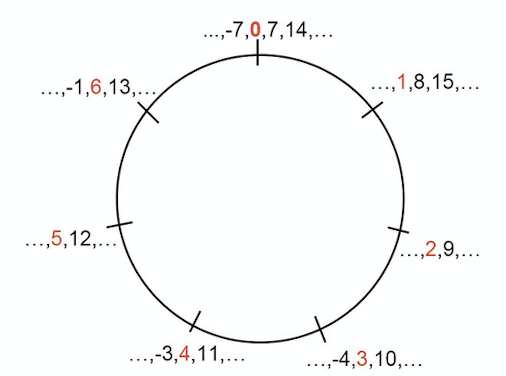

<title>3.2: Modular Arithmetic – Number Theory</title>

# 3.2: Modular Arithmetic
---

 

Jump to:

- [Motivation](#motivation)
	- [Parity](#parity)
	- [Clock](#clock)
- [Formalization](#formalization)
- [Arithmetic](#arithmetic)
	- [Order of Operations](#orderofop)
	- [Exponentiation](#exp)
	- [Fermat's Little Theorem](#flt)

 

<a name='motivation'>

## Motivation
---

</a>

Before diving into any definitions, let's look at a few motivating examples. 

<a name='parity'>

### Example: Parity
---

</a>

_Note: We use the term "parity" to reflect whether a number is odd or even._

Consider the set of odd numbers and even numbers (where "numbers" here represents the set of integers). We know that every number is either even or odd. Furthermore, when we divide any even number by $$2$$, the remainder is $$0$$, and when we divide any odd number by $$2$$, the remainder is $$1$$.

In this sense, we can say all odd numbers – for example, $$-3, 15, 1, 7, 9$$ – are all "equivalent" to $$1$$, and similarly, we can say all even numbers are "equivalent" to $$0$$. In this new number system, everything is equivalent to one of $$\\{0, 1\\}$$. We can then perform the standard addition and multiplication operations on these numbers:

$$\begin{align*} 15 + 22 &\equiv 1 + 0 \equiv 1 \\\ 15 \cdot 22 &\equiv 1 \cdot 0 \equiv 0\end{align*}$$

_Notice we didn't use the standard equals sign, but instead used $$\equiv$$, which means "equivalent"._

The result under this "equivalence" – either $$1$$ or $$0$$ – tells us the parity of the original result (odd or even).

 

<a name='clock'>

### Example: Clock
---

</a>

Another standard introductory example is the idea of a clock. Suppose you look at an analog clock and it reads $$5$$, and you want to know what time it will be in $$13$$ hours. The result you are looking for is $$6$$, not $$18$$ – after we pass the value of $$11$$, we wrap around back to $$0$$.

On an analog clock, there are really only $$12$$ numbers: $$\\{0, 1, 2, 3, 4, 5, 6, 7, 8, 9, 10, 11\\}$$. Every other number when we are dealing with a clock is equivalent to one of these numbers.

 

<a name='formalization'>

## Formalization
---

</a>

Formally, we say

$$a \equiv b \\: (\text{mod} \\: m)$$ if and only if $$m | (a - b)$$

This reads, $$a$$ and $$b$$ are **equivalent (or congruent) modulo** $$m$$ if and only iff $$m$$ divides $$a - b$$ (or equivalently, $$b - a$$). Another way of thinking about this is $$a \equiv b \\: (\text{mod} \\: m)$$ if and only if $$a, b$$ have the same remainder when divided by $$m$$. For instance, $$18 \equiv 33 \\: (\text{mod} \\: 5)$$, since $$33 - 18 = 15$$, and $$5 | 15$$. We can also think of this as $$a$$ and $$b$$ differing by a multiple of $$m$$, i.e. $$b = a + mk, k \in \mathbb{Z}$$.

Sometimes, context depending, we use "$$\text{mod} \\: m$$" to refer to the modulo operator. $$a \\: (\text{mod} \\: m)$$ refers to $$r$$ in $$a = mq + r$$, i.e. $$a \equiv m\\: (\text{mod} \\: m)$$. (In other words, $$a \\: (\text{mod} \\: m)$$ refers to `a % m` in Python.)

 

When dealing with numbers $$\text{mod} \\: m$$, all integers can be reduced to one of 

$$\\{0, 1, 2, 3, ..., m - 1\\}$$

**This is the set of all possible remainders when dividing by $$m$$**.

For example, consider the set of integers $$\text{mod} \\: 3$$. All integers are equivalent to a number in the set $$\\{0, 1, 2\\}$$. For instance, under modulo $$3$$, we have that $$33 \equiv 0$$ and $$11 \equiv 2$$.

Suppose that $$a \equiv r \\: (\text{mod} \\: m)$$. We can add any integer multiple of $$m$$ to $$a$$, and the equivalence still holds, since the remainder when dividing by $$m$$ doesn't change:

$$\begin{align*} a &= mq + r \\\ a + m &= mq + m + r = m(q + 1) + r \end{align*}$$

This tells us that we can add (or subtract) any integer multiple of $$m$$ and the equivalence will still hold true, i.e. $$a + km \equiv a \\: (\text{mod} \\: m)$$. Therefore, the following are all equivalent to $a$ in modulo $m$:

$$\\{ ..., a-2m, a-m, a, a + m, a+2m, ... \\}$$

For example, all elements in the following set are equivalent to $$3 \\: (\text{mod} \\: 5)$$, and can thus be "reduced" to $$3$$:

$$\\{ ... ,-12, -7, -2, 3, 8, 13, 18, 23, ... \\}$$

Note, this implies that negative integers also have equivalences in modular arithmetic, e.g. $$-12 \equiv 3 \\: (\text{mod} \\: 5)$$.

_Image taken from [ias.edu](https://www.ias.edu/ideas/2012/taylor-modular-arithmetic)_

 

<a name='arithmetic'>

## Arithmetic
---

</a>

<a name='orderofop'>

### Order of Operations – Addition and Multiplication
---

</a>

Suppose we want to simplify $13 + 14 \cdot 6 \\: (\text{mod} \\: 5)$. We could do the following:

$$13 + 14 \cdot 6 \equiv 13 + 84 \equiv 97 \equiv 2 \\: (\text{mod} \\: 5)$$

However, we could also simplify things first:

$$13 + 14 \cdot 6 \equiv 3  + 4 \cdot 1 \equiv 7 \\: (\text{mod} \\: 5) \equiv 2 \\: (\text{mod} \\: 5)$$

or even

$$13 + 14 \cdot 6 \equiv -2 + 4 \cdot 1 \equiv 2 \\: (\text{mod} \\: 5)$$

Regardless of the order we simplify things in, the "lowest form" result – i.e. the result in the set $$\\{0, 1, 2, 3, 4 \\}$$ – always ends up being the same.

In general, if we have $$a \equiv b \\: (\text{mod} \\: m)$$ and $$c \equiv d \\: (\text{mod} \\: m)$$, the following hold:

$$\boxed{\begin{align*} a + c &\equiv b + d  \\: (\text{mod} \\: m) \\\ a \cdot c &\equiv b \cdot d \\: (\text{mod} \\: m) \end{align*} }$$

Let's prove each of these properties.

#### Addition

If $$a \equiv b \\: (\text{mod} \\: m)$$ and $$c \equiv d \\: (\text{mod} \\: m)$$, then $$b = a + mk_1$$ and $$d = c + mk_2$$. 

$$\begin{align*}b + d &= a + c + mk_1 + mk_2 \\\ &= (a + c) + m(k_1 + k_2) \\\ &= (a + c) + m \cdot (\text{some integer}) \\\ \implies b + d &\equiv a + c \\: (\text{mod} \\: m) \end{align*}$$

#### Multiplication

Multiplying our expressions for $$b$$ and $$d$$:

$$\begin{align*} bd &= (a + mk_1)(c + mk_2) \\\ &= ac + ak_2m + ck_1m + k_1k_2m^2 \\\ &= ac + m(ak_2 + ck_1 + k_1k_2m) \\\ &= ac + m \cdot (\text{some integer}) \\\ \implies bd &\equiv ac \\: (\text{mod} \\: m)\end{align*}$$

The key takeaway of these proofs is that we can "simplify $$\text{mod} \\: m$$" as we go, in any order.

 

<a name='exp'>

### Exponentiation
---

</a>

Suppose we want to evaluate $$2^{15} \\: (\text{mod} \\: 9)$$. We _could_ find $$2^{15} = 32768$$, and divide this number by $$9$$ and find the remainder, but there's a better way.

$$2^{15} = (2^3) ^5 $$

We can use the fact that $$2^3 \equiv 8 \equiv -1 \\: (\text{mod} \\: 9)$$:

$$(2^3)^5 \equiv (-1)^5 \equiv -1 \equiv 8 \\: (\text{mod} \\: 9)$$

Other examples:

- $$5^{11} \\: (\text{mod} \\: 26) \equiv (5^2)^5\cdot 5 \equiv (-1)^5 \cdot 5 \equiv -5 \\: \equiv 21 \\: (\text{mod} \\: 26)$$
- $$23^9 \\: (\text{mod} \\: 24) \equiv (-1)^9 \equiv -1 \equiv 23 \\: (\text{mod} \\: 24) $$

 

For calculations that are more involved, we can consider the idea of **repeated squaring**. Repeated squaring uses the fact that any integer can be written as the sum of powers of two (because any integer can be written in binary).

Suppose we want to consider $$4^{26} \\: (\text{mod} \\: 13)$$. We can write $$26 = 16 + 8 + 2$$, implying that we can write $$4^{26}$$ as $$4^{16} \cdot 4^8 \cdot 4^2$$. 

Now, we can start with $$4$$ and repeatedly square it (modulo $$13$$), yielding $$4^2, 4^4, 4^8$$ and $$4^{16}$$.

$$\begin{align*} 4^1 &\equiv 4 \\: (\text{mod} \\: 13) \\\ 4^2 \equiv 16 &\equiv 3 \\: (\text{mod} \\: 13) \\\ 4^8 \equiv (4^2)^4 \equiv 3^4 \equiv 81 &\equiv 3 \\: (\text{mod} \\: 13) \\\ 4^{16} \equiv (4^8)^2 \equiv 3^2 \equiv 16 &\equiv 9  \\: (\text{mod} \\: 13) \end{align*}$$

Combining these results: 

$$\begin{align*} 4^{26} &\equiv 4^{16} \cdot 4^{8} \cdot 4^2 \\\ &\equiv 3 \cdot 3 \cdot 9 \\\ &\equiv 27 \cdot 3 \\\ &\equiv (1) \cdot 3 \\\ &\equiv 3 \\: (\text{mod} \\: 13) \end{align*} $$

 

<a name='flt'>

### Fermat's Little Theorem
---

</a>

Another property we can use for simplifcation in modular arithmetic is Fermat's Little Theorem (FLT), which states

$$\boxed{a^{p} \equiv a \\: (\text{mod } p), p \text{ is prime}}$$

or, given that $$a$$ is not a multiple of $$p$$,

$$\boxed{a^{p-1} \equiv 1 \\: (\text{mod } p), p \text{ is prime}}$$

We can use either of the two forms in helping us simplify expressions.

Let's use FLT to simplify $$5^{73} \\: (\text{mod } 7)$$.

$$\begin{align*} 5^{73} &\equiv (5^6)^{12} \cdot 5^1 \\\ &\equiv 1^{12} \cdot 5 \\\ &\equiv 5 \\: (\text{mod } 7) \end{align*}$$

<a name='examples'>

## Examples
---

</a>

Using modular arithmetic can make many of the proofs that we previously did involving divisibility significantly easier. 

#### Example 1

**Prove that $$4 | 5^n - 1, \forall n \in \mathbb{N}$$.**

Previously, we did this proof using induction on $$n$$. However, this problem really is asking us to prove that $$5^n - 1 \equiv 0 \\: (\text{mod} \\: 4)$$, which we can do pretty easily:

$$\begin{align*} 5^n - 1 &\equiv 1^n - 1 \\\ &\equiv 1 - 1 \\\ &\equiv 0 \\: (\text{mod} \\: 4) \end{align*}$$

 

#### Example 2

**Prove that $$3 | n^3 - n, n \in \mathbb{N}$$.**

Again, we've previously done this proof using casework or induction. However, with Fermat's Little Theorem, this comes out directly:  $$a^3 \equiv a \\: (\text{mod } 3)$$, and thus $$3 | a^3 - a$$ for any $$a \in \mathbb{N}$$. We're done!

However, suppose for a second that we didn't know Fermat's Little Theorem. Then, could use the fact that we know any number under modulo $$3$$ is equivalent to either $$0$$, $$1$$, or $$2$$. Then, we only need to look at these three cases, as they cover all naturals.

$$\begin{align*} 0^3 - 0 &\equiv 0 \\: (\text{mod} \\: 3) \\\ 1^3 - 1 &\equiv 0 \\: (\text{mod} \\: 3) \\\ 2^3 - 2 = 6 &\equiv 0 \\: (\text{mod} \\: 3) \end{align*}$$

Thus, in all cases, $$n^3 - n \equiv 0 \\: (\text{mod} \\: 3)$$, and so $$3 | n^3 - n$$.

 

#### Example 3

**Prove that any odd square is of the form $$8k + 1$$, where $$k$$ is an integer.**

This question boils down to showing that if $$n$$ is an odd number, then $$n^2 \equiv 1 \\: (\text{mod} \\: 8)$$. Notice, under modulo $$8$$, there are essentially only $$8$$ unique numbers – $$0, 1, 2, 3, 4, 5, 6$$ and $$7$$.

Futhermore, only $$1, 3, 5$$ and $$7$$ correspond to odd numbers. This is because, in modulo $$8$$, $$1, 3, 5$$ and $$7$$ really correspond to numbers of the form $$8c + 1$$, $$8c + 3$$, $$8c + 5$$, and $$8c + 7$$. (The other cases, $$8c, 8c + 2, 8c + 4$$ and $$8c + 6$$ can all clearly be written as even numbers.)

Then:

$$\begin{align*} 1^2 &\equiv 1 \\: (\text{mod} \\: 8) \\\ 3^2 \equiv 9 &\equiv 1 \\: (\text{mod} \\: 8) \\\ 5^2 \equiv 25 &\equiv 1 \\: (\text{mod} \\: 8) \\\ 7^2 \equiv (-1)^2 &\equiv 1 \\: (\text{mod} \\: 8) \end{align*}$$

Therefore, in all cases, if $$n$$ is odd, then $$n^2 \equiv 1 \\: (\text{mod} \\: 8)$$, hence proving the claim.
