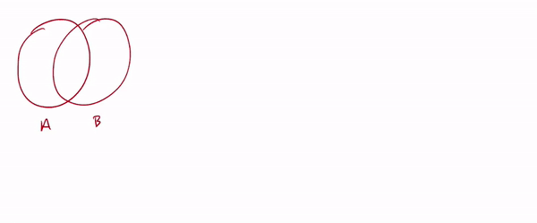

<title>Principle of Inclusion-Exclusion – IMT DeCal</title>

# Principle of Inclusion-Exclusion

_by Suraj Rampure_ 
_Last modified: March 21, 2019_

---

 

<!--

Jump to:
- [Product Rule](#product)
	- [Example: Number of Factors](#ex-numfactors)

 

-->

Here, we will re-visit the Principle of Inclusion and Exclusion. 

_Note: You may find it easier to understand the Principle of Inclusion-Exclusion by watching a video. Two from this class are linked below. The former also has a walkthrough of the derivation for three sets._

- [HW 1 walkthrough video from Spring 2019](https://youtu.be/_bIum7LkZmk?t=202)
- [Lecture 2 from Spring 2019](https://youtu.be/P90P-sYNgPs?t=1547)

**PIE for two sets**: Suppose $$A$$ and $$B$$ are two sets, and we want to count the number of elements in $$A \cup B$$, i.e. $$|A \cup B|$$, assuming that we know $$|A|$$, $$|B|$$, and $$|A \cap B|$$, the cardinality of the intersection of $$A$$ and $$B$$.

First, we count every item in $$A$$ and $B$ individually, yielding $$|A| + |B|$$. We then see that the intersection $$A \cap B$$ has been counted twice – once in $$|A|$$, and once in $$|B|$$. By subtracting $$|A \cap B|$$ we yield $$|A \cup B| = |A| + |B| - |A \cap B|$$ as required.

 

**PIE for three sets**: Let's now derive an expression for $$|A \cup B \cup C|$$ in terms of the individual cardinalities and all possible intersections.

Again, we start by counting each set individually, giving us $$|A| + |B| + |C|$$. We now notice that each pairwise overlap has been counted twice – $$|A \cap B|$$ was counted in both $$|A|$$ and $$|B|$$, $$|A \cap C|$$ was counted in both $$|A|$$ and $$|C|$$, and $$|B \cap C|$$ was counted in both $$|B|$$ and $$|C|$$; additionally, the triple intersection $$|A \cap B \cap C|$$ is counted three times. 

By subtracting $$|A \cap B|$$, $$|A \cap C|$$ and $$|B \cap C|$$, we have subtracted the triple overlap $$|A \cap B \cap C|$$ three times (as it is part of each pairwise intersection). Since it was originally counted three times, we need to add it back once. Thus, our final relation yields $$|A \cup B \cup C| = |A| + |B| + |C| - |A \cap B| - |A \cap C| - |B \cap C| + |A \cap B \cap C|$$.

 

To summarize:

$$\boxed{|A \cup B| = |A| + |B| - |A \cap B|}$$

$$\boxed{|A \cup B \cup C| = |A| + |B| + |C| - |A \cap B| - |A \cap C| - |B \cap C| + |A \cap B \cap C|}$$

 

### Example

**Suppose there are 150 high school seniors at Billy High, and suppose each senior is required to take at least one of Calculus or Statistics. If 100 students are enrolled in Statistics, and 70 are enrolled in Statistics, how many are enrolled in both?**

Let $$C$$ be the set of students taking Calculus, and $$S$$ be the set of students taking Statistics. We are given $$| C \cup S| = 100$$, $$| C | = 70$$ and $$| S | = 100$$, and we are asked to find $$| C \cap S |$$. PIE states $$|P \cup C| = |P| + |C| - |P \cap C|$$. Substituting our known quantities yields $150 = 70 + 100 - | C \cap S|$, implying that there are $| C \cap S | = 20$ students taking both Calculus and Statistics.

 

**Now, suppose students aren't necessarily required to take either Calculus or Statistics; they can elect to take neither. If 25 students are taking both, 100 students are taking Calculus and 20 students are taking neither, how many students are taking Statistics?**

We have two unknowns – $|C \cup S|$ and $|S|$. We need two equations in terms of these unknown quantities to solve for them. We can use the Principle of Inclusion-Exclusion to find $| C \cup S | = 100 + | S | - 25$. To continue, we must realize that we're actually given the size of the universe, $\big| U \big| = 150$. Either a student is taking one of the courses, or they are not. The sum of the number of students in each of these disjoint groups must be 150. We are given that 25 students aren't taking either course, meaning $150 = | C \cup S | + 25$, i.e. $| C \cup S | = 125$, allowing us to solve $|S|  = 50$.

 

In the note titled [Key Examples in Counting](key-examples-counting.html), we will use PIE in some rather interesting examples.

 