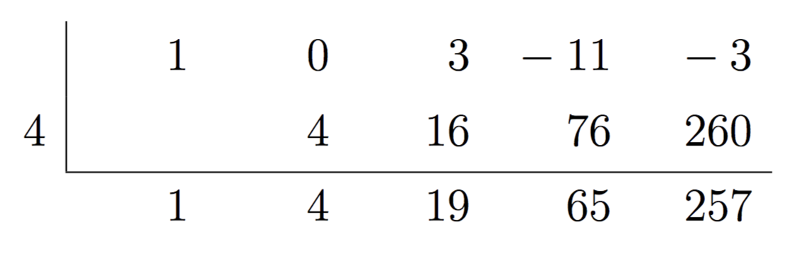

<title>Factor and Remainder Theorems – IMT DeCal</title>

# Factor and Remainder Theorems
---

 

<!--

Jump to:
- [Division Algorithm for Polynomials](#divisionalgo)
- [Polynomial Division](#polydiv)
	- [Polynomial Long Division](#longdiv)
	- [Synthetic Division](#syntheticdiv)
- [Remainder and Factor Theorems](#factrem)
	- [Remainder Theorem](#remainder)
	- [Factor Theorem](#factor)
- [Roots](#roots)
	- [Complex Roots](#complex)
	- [Complex Root Pairs](#complexpair)

-->

In this note, we will look at two theorems that formalize properties you are likely already aware of. These properties will allow us to explore the relationship between the degree of a polynomial and the number of roots it has. 

Before we look at these theorems, we need to look at another idea – the division of polynomials. As you will see, there are many parallels between polynomial division and regular integer division.

 

<a name='divisionalgo'>

## Division Algorithm for Polynomials
---

</a>

Recall the division algorithm for integers, which said that given some dividend $n$ and divisor $d$, it is always possible to write $n = d q + r$, where $q$ is the quotient and $r$ is the remainder, with $r < d$. 

What if we want to divide some polynomial $$p(x)$$ by some other polynomial $$d(x)$$? Well, essentially the same statement holds: if $$p(x), d(x)$$ are polynomials such that $$\text{deg}(p(x))\geq \text{deg}(d(x))$$, then it is possible to find polynomials $$q(x), r(x)$$ such that 

$$p(x) = d(x)q(x) + r(x)$$

where $$\text{deg}(q(x)) = \text{deg}(p(x)) - \text{deg}(d(x))$$ and $$\text{deg}(r(x)) < \text{deg}(d(x))$$

 

$$d(x)$$ is the divisor, $$q(x)$$ is the quotient and $$r(x)$$ is the remainder. For simplicity's sake, we will almost always only look at linear divisors; that is, $$d(x)$$ will usually be of the form $$x - a$$ or $$cx - a$$. 

For example, suppose we want to show the division of $$p(x) = x^2 - 5x + 6$$ by $$d(x) = x - 1$$. It turns out the corresponding quotient is $$q(x) = x - 4$$ and remainder is $$r(x) = 2$$: 

 $$x^2 - 5x + 6 = (x-1)(x-4) + 2$$ 
  

The question is, how did we find that value of $$q(x)$$ and $$r(x)$$? While some of the theorems presented later in this article may ease the process, the way to do this in general for any (valid) degrees of $$p(x)$$ and $$d(x)$$ is through **polynomial division**. 

 

<a name='polydiv'>

## Polynomial Division
---

</a>

There are two ways we can divide one polynomial by another.

<a name='longdiv'>

### Polynomial Long Division
---

</a>

Polynomial long division is directly analagous to regular long division. Let's jump into an example - we'll divide $$p(x) = x^2 - 5x + 6$$ by $$d(x) = x - 7$$: 

 

As we do in integer long division, we iteratively multiply across and subtract downwards, until we are left with a remainder. We know that our remainder has to be a constant, as our divisor has degree 1 and the remainder's degree must be strictly less than the divisor's degree, so that's when we know when to stop. 

Using the quotient and remainder we obtain from above, we can format our division using the division algorithm: $$x^2 - 5x + 6 = (x-7)(x+2) + 20$$. 

 

Now, we'll look at a higher degree example. Let $$p(x) = 4x^4 - 10x^3 + 7x^2 - 11x - 9$$ and $$d(x) = 2x^2 + 10x + 3$$. 

 

Again, this tells us that we can write $$4x^4 - 10x^3 + 7x^2 - 11x - 9 = (2x^2 + 10x + 3)(2x^2 - 15x + \frac{151}{2}) - 721x - \frac{471}{2}$$. Here, while $$r(x)$$ is not a constant (it is the linear polynomial $$-721x - \frac{471}{2}$$), its degree is still less than the degree of $$d(x)$$.
 

As with many things in this course, it'll be very difficult to understand how to do polynomial division just by looking at this one example. Practice will be key here. 

 

<a name='syntheticdiv'>

### Synthetic Division
---

</a>

Synthetic division is a short-form way of performing polynomial long division. While it can be done with divisors that are non-linear, for simplicity's sake, we will stick with linear factors.

Once again, let's dive directly into an example, and then work our way through it. We'll use the same example as in the previous section. 

 

- If we divide by $$x-a$$, the number we write on the left-hand side is $$a$$ (which is why we put a $$7$$ there)
	- Formally, we set the divisor to $$0$$, so if we were dividing by $$ax - b$$, we'd use $$\frac{b}{a}$$ as this value
- The top row represents the coefficients of the dividend $$p(x)$$ – the leftmost column is the highest degree term, the next column is the second highest degree term, etc.
- The very bottom row represents the quotient and remainder
	- We know that by dividing a degree 2 polynomial by a degree 1, our result will be a polynomial of degree 1 and remainder will be a constant
	- The rightmost number is the remainder, $$20$$, whereas the two terms to the left represent the quotient $$x + 2$$

The process is iterative - we add downwards, and multiply numbers in the bottom row by $$a$$ ($$7$$) to create numbers in the middle row.
- We always bring down the leading coefficient. 
- The $$7$$ in the middle row is the result of multiplying $$7 \times 1$$
- The $$2$$ in the bottom row is the result of adding $$-5 + 7$$
- The $$14$$ in the middle row is the result of multiplying $$7 \times 2$$
- The $$20$$ in the bottom row is the result of adding $$6 + 14$$

Another example:

 

Here, we divided $$p(x) = x^4 + 3x^2 - 11x - 3$$ by $$x-4$$ to yield the quotient $$q(x) = x^3 + 4x^2 + 19x + 65$$ with remainder $$r(x) = 257$$. 

 

<a name='factrem'>

## Remainder and Factor Theorems
---

</a>

Now, we're equipped to do some analysis regarding the division algorithm. 

<a name = 'remainder'>

### Remainder Theorem
---

</a>

Suppose we're dividing some arbitrary polynomial $$p(x)$$ by linear divisor $$x-a$$. Then, we can say $$p(x) = (x-a)q(x) + r(x)$$.

What happens if we evaluate $$p(a)$$? Well, the first term cancels out since $$a - a = 0$$, and we're left with $$r(a)$$. This result is known as the **remainder theorem**. 

Formally, the remainder theorem states that **if $$p(x)$$ is a polynomial, such that $$r(x)$$ is the remainder that results from dividing $$p(x)$$ by $$x - a$$, then $$p(a) = r(a)$$**. (Notice that this only applies to polynomial divisions with linear divisors.)

As a sanity check: When introducing polynomial division, we showed that $$x^2 - 5x + 6 = (x-7)(x+2) + 20$$, meaning that the remainder when dividing $$x^2 - 5x + 6$$ by $$x - 7$$ was $$20$$. We can also easily verify that $$p(7) = 7^2 - 5 \cdot 7 + 6 = 49 - 35 + 6 = 20$$. 

 

<a name='factor'>

### Factor Theorem
---

</a>

What if we had that $$r(x) = 0$$? Then, we'd write $$p(x) = (x-a)q(x)$$, meaning that $$x-a$$ evenly divided $$p(x)$$, i.e. that $$x-a$$ was a **factor** of $$p(x)$$. This leads to the **factor theorem**, which is a more specific case of the remainder theorem. 

**Specifically, the factor theorem states that $$x-a$$ is a factor of $$p(x)$$ if and only if $$p(a) = 0$$.**

Clearly, $$x - 7$$ is not a factor of $$p(x) = x^2 - 5x + 6$$, since the remainder is 20 (or, equivalently, $$p(7) = 20 \neq 0$$). However, $$x - 3$$ is a factor of $$p(x)$$, as $$x^2 - 5x + 6 = (x-3) (x-2) + 0$$ (or, equivalently, $$p(3) = 0$$). As another example, since we can factor $$p(x) = x^3 + 7x^2 + 6x$$ into $$p(x) = x(x + 1)(x + 6)$$, we know that $$p(0) = p(-1) = p(-6) = 0$$.

We now have all of the tools necessary to formally discuss the nature of complex roots.

 

<a name='roots'>

## Roots
---

</a>

The final key property of polynomials determined by their degree are their number of roots. You may have learned before that a real-valued polynomial with real coefficients of degree $$n$$ has anywhere between 0 and $$n$$ roots, depending on its specifics. However, we can actually make a stronger claim.

**All real-valued polynomials with real coefficients of degree $n$ have exactly $n$ roots, with some possibly complex roots.** 

Let's disect this. The first class of polynomial we encounter with varying numbers of roots is the parabola, of degree $2$. You may have studied before that parabolas have one of the following:

- $2$ roots, meaning they intercept the $x$ axis twice
- $1$ root, meaning they sit on the $x$ axis (this is actually known as a double root)
- $0$ roots, meaning that they sit completely above or completely below the $x$ axis

Recall, given a quadratic of the form $f(x) = ax^2 + bx + c$, the solutions to $f(x) = 0$ are given by $$x = \frac{-b \pm \sqrt{b^2 - 4ac}}{2a}$$.

The three cases above come from the three different states of the discriminant, $b^2 - 4ac$. When $b^2 - 4ac > 0$, there are two distinct roots. When $b^2 - 4ac = 0$, the \"plus-or-minus\" term vanishes, leaving a double root at $x = -\frac{b}{2a}$. The case we're now interested in is when $b^2 - 4ac < 0$, where we would previously claim there to be \"no solution\" since we cannot take the square root of a negative number. In fact, there are still two perfectly valid solutions - they're just not real numbers.

 

<a name='complex'>

### Complex Roots
---

</a>

Complex numbers (discussed in the appendix, if you need a refresher) are a superset of the real numbers. We can represent a complex number $z$ in **rectangular form** as $z = a + bi$, where $a, b$ are real numbers and $i$ is the imaginary unit defined by $i^2 = -1$. We say $a$ is the "real part" and $bi$ is the "imaginary part." We can represent the set of real numbers as complex numbers, with $b = 0$.

The simplest parabola that has complex roots is $p(x) = x^2 + 1$, which sits one unit above the $x$ axis, centered on the $y$ axis. It has roots $x_1 = i$ and $x_2 = -i$, respectively, which you can verify with the quadratic equation or by evaluating $$p(x_1), p(x_2)$$. 

An important consequence of our new, stronger definition of the number of roots of a polynomial is that **all polynomials are now completely factorable into linear terms**, whereas previously this was not the case. Previously, we could factor $x^2 + 5x + 6$ and $x^2 - 16$ into $(x+2)(x+3)$ and $(x-4)(x+4)$, respectively, because we knew these polynomials in standard form had roots. However, now we can factor $x^2 + 1$ as well, into $(x-i)(x+i)$, by the factor theorem. In general,

$$p(x) = \sum_{k = 0}^n a_kx^k = a(x-r_1)(x-r_2)(x-r_3)...(x-r_{n-1})(x-r_n)$$ $$= a\prod_{i = 0}^n (x - r_i)$$

where $a$ is some real constant and $$r_1, r_2, ... r_n$$ represent the roots of $$p(x)$$. Remember, our polynomials still only take and return real numbers as inputs and outputs, and all coefficients are still real numbers. It's just the roots that are potentially complex.

 

<a name='complexpair'>

### Complex Root Pairs
---

</a>

As it turns out, complex roots always occur in pairs. No real polynomial can have only a single complex root, or three complex roots, or any odd number of complex roots. Furthermore:

$$f(a + bi) = 0 \implies f(a - bi) = 0$$

This says that if a complex number is a root of a real polynomial, its **complex conjugate** must also be a root. Conjugates are defined exactly as above -- the conjugate of $z = a + bi$ is $\bar{z} = a - bi$. Complex conjugates are defined this way for the following reason:

$$z\bar{z} = (a + bi)(a - bi) = a^2 - abi + bai - b^2i = a^2 - b^2i = a^2 + b^2$$

When multiplying a complex number by its conjugate, the imaginary parts fall out and we're left with a real number. In particular, this real number $z\bar{z} = |z|^2$ is the **square of the magnitude** of the complex number, i.e. the squared distance from $0$.

Let's justify why $a + bi$ and $a - bi$ will always exist together as roots. By the factor theorem, if they are both roots of some $p(x)$ of degree $n$: 

$$\begin{aligned} p(x) &= (x-r_1)(x-r_2)(x-r_3)...(x - r_{n-2})\left[(x - (a + bi))(x - (a - bi))\right] \\\ &= (x-r_1)(x-r_2)(x-r_3)...(x - r_{n-2})\left[x^2 - ((a - bi) + (a + bi))x - (a+bi)(a-bi) \right] \\\ &= (x-r_1)(x-r_2)(x-r_3)...(x - r_{n-2})\left[x^2 - 2ax - (a^2 + b^2) \right] \end{aligned} $$

The product $(x - (a + bi))(x - (a - bi))$ yields a completely real polynomial. This real polynomial, multiplied by the rest of $(x - r_1)(x - r_2)...(x-r_{n-2})$, which is assumed to be real, will result in a real $p(x)$. However, if $(x - (a + bi))$ were multipled by $(x - (c + di))$, for any other complex number $c + di \neq a - bi$, the resulting last term of $p(x)$ would contain complex terms, meaning that $p(x)$ would have complex coefficients, going against our definition set in the beginning.

To show this, a good exercise is to multiply out $$(x - (a + bi))(x - (c + di))$$ and show that the only way for this product polynomial to be real is if $$c = a$$ and $$d = -b$$. 